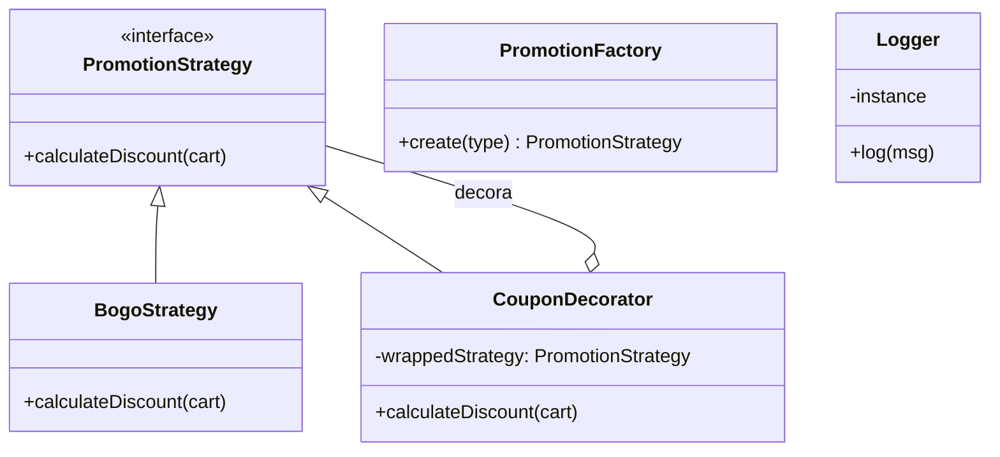

# Sistema de Promoções de Varejo - Design Patterns

**Autor:** Lucas Weigel

Este projeto implementa um motor de cálculo de promoções para um sistema de varejo fictício. O objetivo principal é demonstrar a aplicação prática de **Padrões de Projeto (Design Patterns)** para resolver problemas de flexibilidade e manutenção em regras de negócio complexas.

---

## O Problema

Em sistemas de varejo, as regras de descontos mudam constantemente (ex: "Leve 3 Pague 2", "Compre 1 Leve o 2º Grátis", "Desconto progressivo"). Implementar isso com cadeias infinitas de `if/else` torna o código difícil de manter e testar.

A solução proposta utiliza **Orientação a Objetos** e **Padrões GoF** para permitir a troca dinâmica de estratégias de desconto e a composição de benefícios (ex: Promoção da loja + Cupom de desconto).

---

## Padrões de Projeto Utilizados

Para atender aos requisitos de flexibilidade, foram implementados os seguintes padrões:

### 1. Strategy (Comportamental)
* **Local:** `src/strategies/`
* **Justificativa:** Permite encapsular diferentes algoritmos de promoção (ex: `BogoStrategy` para "Buy One Get One") em classes separadas. Isso permite que o sistema troque a regra de cálculo em tempo de execução sem alterar a classe do Carrinho ou do Produto.

### 2. Decorator (Estrutural)
* **Local:** `src/decorators/`
* **Justificativa:** Utilizado para adicionar responsabilidades (descontos extras) a uma promoção existente de forma dinâmica. O `CouponDecorator` envolve uma estratégia base e aplica um desconto percentual adicional sobre o resultado, permitindo "empilhar" promoções.

### 3. Factory Method (Criação)
* **Local:** `src/factory/`
* **Justificativa:** Centraliza a lógica de instanciação das estratégias. O cliente (`Menu/CLI`) não precisa saber qual classe concreta instanciar (ex: `new BogoStrategy()`); ele apenas solicita ao `PromotionFactory` com base em uma string de configuração.

### 4. Singleton (Criação/Infraestrutura)
* **Local:** `src/infra/Logger.js`
* **Justificativa:** Garante que exista apenas uma instância da classe de Log em toda a aplicação, centralizando a saída de informações e economizando recursos.

---

## Diagrama de Classes



## Estrutura do Projeto

O projeto segue uma arquitetura modular para separar domínio, regras de negócio e infraestrutura:

```text
Trabalho 04 - Design Patterns/
│
├── src/
│   ├── domain/         # Entidades (Product, Cart)
│   ├── strategies/     # Regras de Promoção (Strategy)
│   ├── decorators/     # Modificadores de desconto (Decorator)
│   ├── factory/        # Criador de estratégias (Factory Method)
│   ├── infra/          # Serviços transversais (Singleton Logger)
│   └── app/            # Ponto de entrada (Menu CLI)
│
├── tests/              # Testes automatizados
└── README.md
```

## Como Rodar o Projeto
## Pré-requisitos
Node.js instalado (versão 12 ou superior).

Executando o Sistema (CLI)

Navegue até a pasta raiz do projeto e execute o comando abaixo:


```node src/app/main.js```
Siga as instruções no menu interativo para escolher a promoção e aplicar cupons.

Executando os Testes

Os testes foram criados utilizando o módulo nativo assert do Node.js, garantindo que não há dependências externas pesadas.


```node tests/run_tests.js```

Cenários cobertos: Unicidade do Singleton, Criação via Factory, Cálculo do BOGO e Composição de Decorators.
    
